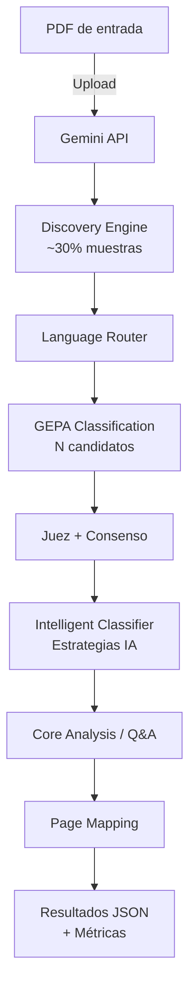

# Understanding · Document Analysis System
**Sistema autónomo para análisis de documentos técnicos (PDF) con esquemas dinámicos y optimización genética (GEPA).**

[](https://github.com/karimtouma/understanding/actions/workflows/ci.yml)
[](https://github.com/karimtouma/understanding/actions)
[](https://github.com/karimtouma/understanding/actions)
[](https://github.com/karimtouma/understanding/actions)
[](https://github.com/karimtouma/understanding/security)
[](https://github.com/karimtouma/understanding/actions)

[](https://opensource.org/licenses/BSD-2-Clause)
[](https://www.python.org/downloads/)
[](https://www.docker.com/)
[](https://ai.google.dev/)
[](https://github.com/karimtouma/understanding)

---

## Tabla de contenidos
- [Resumen](#resumen)
- [Características clave](#características-clave)
- [Arquitectura](#arquitectura)
- [Rendimiento y costos](#rendimiento-y-costos)
- [Requisitos](#requisitos)
- [Inicio rápido](#inicio-rápido)
- [Ejecución](#ejecución)
  - [Local (Make)](#local-make)
  - [Docker](#docker)
- [Configuración](#configuración)
  - [Variables de entorno](#variables-de-entorno)
  - [config.toml](#configtoml)
- [Resultados y formatos](#resultados-y-formatos)
- [Estructura del repositorio](#estructura-del-repositorio)
- [Calidad y CI/CD](#calidad-y-cicd)
- [Guía de desarrollo](#guía-de-desarrollo)
- [Roadmap](#roadmap)
- [Seguridad y privacidad](#seguridad-y-privacidad)
- [Contribución y gobernanza](#contribución-y-gobernanza)
- [Soporte y contacto](#soporte-y-contacto)
- [Licencia](#licencia)
- [Agradecimientos](#agradecimientos)

---

## Resumen

**Understanding** automatiza el análisis de documentos técnicos en PDF. No requiere taxonomías previas: descubre la estructura del documento, clasifica elementos con múltiples candidatos y selecciona el mejor mediante un **juez inteligente** y **consenso**, optimizando continuamente con técnicas evolutivas (**GEPA**). Incluye enrutamiento de idioma (detección/optimización de prompts), análisis contextual y mapeo completo de páginas.

---

## Características clave

### 1) Autonomía completa
- **Esquemas dinámicos**: Adaptación automática a distintos tipos de documentos técnicos
- **Descubrimiento inteligente**: Identificación de patrones sin configuración previa
- **Clasificación adaptativa**: Registro automático de nuevos tipos de elementos
- **Sin configuración inicial**: Funciona de inmediato, sin taxonomías predefinidas

### 2) GEPA Optimization System
- **Múltiples candidatos** por elemento (típicamente 5)
- **Juez inteligente**: Evaluación técnica con criterios especializados
- **Consenso automático** entre candidatos para validación
- **Evolución genética**: Mejora continua de prompts y estrategias
- **Inspirado en**: [Algoritmos genéticos](https://en.wikipedia.org/wiki/Genetic_algorithm) y [DSPy](https://github.com/stanfordnlp/dspy)

### 3) Language Router
- **Detección automática** del idioma principal del documento
- **Optimización adaptativa** de prompts por idioma detectado
- **Soporte multilingüe** para documentos con contenido mixto
- **Salida configurable** en el idioma preferido

### 4) Capacidades de análisis
- **Core analysis**: Contexto global, secciones, entidades y datos clave
- **Q&A adaptativo**: Preguntas contextuales automáticas para completar información
- **Page mapping**: Mapeo completo de páginas y elementos detectados
- **Registro evolutivo**: Aprendizaje continuo basado en evidencia

---

## Arquitectura



**Flujo de procesamiento:**

1. **Upload** → 2. **Discovery** → 3. **Detección de idioma** → 
4. **GEPA (candidatos + juez)** → 5. **Core analysis** → 
6. **Q&A adaptativo** → 7. **Page mapping** → 8. **Resultados**

---

## Rendimiento y costos

> Métricas de referencia para un documento de ~51 páginas. Los valores pueden variar según el documento y configuración.

| Métrica | Valor |
|---------|-------|
| **Tiempo total** | 13-14 min |
| **Costo estimado** | $0.089 USD |
| **Precisión** | 95-100% elementos |
| **Judge Score GEPA** | ~100% |
| **Consenso promedio** | ~95.9% |
| **Eficiencia de caché** | ~49.5% tokens |
| **Tipos descubiertos** | 7-10 únicos |

---

## Requisitos

- **Python 3.12+**
- **Make** (para comandos de conveniencia)
- **jq** (opcional, para explorar JSON de salida)
- **Docker** (opcional, para ejecución contenedorizada)

---

## Inicio rápido

```bash
# 1) Clonar y preparar entorno
git clone https://github.com/karimtouma/understanding.git
cd understanding
make setup

# 2) Configurar credenciales (Gemini)
echo "GEMINI_API_KEY=tu_clave_api" > .env

# 3) Ejecutar un análisis
cp tu_documento.pdf input/file.pdf
make job

# 4) Inspeccionar resultados
cat output/file_comprehensive_analysis.json | jq '.dynamic_schema_results'
```

---

## Ejecución

### Local (Make)

| Comando | Descripción | Tiempo |
|---------|-------------|--------|
| `make job` | Análisis completo autónomo | 13-14 min |
| `make job-quick` | Análisis rápido | 2-3 min |
| `make test` | Ejecutar suite de tests | 2-5 min |
| `make coverage` | Tests con cobertura | 3-6 min |
| `make status` | Verificar configuración | <1 seg |
| `make results` | Ver últimos resultados | <1 seg |

### Docker

```bash
# Build de la imagen
docker build -t understanding:local .

# Ejecución con volúmenes
docker run --rm \
  --env-file .env \
  -v "$PWD/input:/app/input" \
  -v "$PWD/output:/app/output" \
  understanding:local make job

# Con configuración personalizada
docker run --rm \
  --env-file .env \
  -v "$PWD/input:/app/input" \
  -v "$PWD/output:/app/output" \
  -v "$PWD/config.toml:/app/config.toml:ro" \
  understanding:local make job
```

---

## Configuración

### Variables de entorno

```bash
# Requerida
GEMINI_API_KEY=tu_clave_api_gemini

# Opcional
LOG_LEVEL=INFO
```

### config.toml

```toml
[api]
output_language = "auto"
fallback_language = "spanish"

[analysis]
enable_dynamic_schemas = true
auto_register_confidence_threshold = 0.85

# GEPA optimization
enable_gepa_evolution = true
gepa_always_enhance = true
gepa_num_candidates = 5
```

Ver [docs/api-reference.md](docs/api-reference.md) para configuración completa.

---

## Resultados y formatos

La ejecución genera un JSON integral (`output/file_comprehensive_analysis.json`) con:

- `dynamic_schema_results`: Tipos descubiertos y evidencias
- `core_analysis`: Hallazgos globales y por sección
- `qa`: Preguntas/respuestas contextuales
- `page_mapping`: Mapeo de páginas y elementos clasificados
- `metrics`: Tiempos, contadores y métricas GEPA

### Exploración de resultados

```bash
# Tipos detectados
jq '.dynamic_schema_results.discovered_element_types' output/file_comprehensive_analysis.json

# Métricas GEPA
jq '.dynamic_schema_results.gepa_statistics' output/file_comprehensive_analysis.json

# Páginas mapeadas
jq '.page_mapping | length' output/file_comprehensive_analysis.json

# Análisis core
jq '.core_analysis.general_analysis' output/file_comprehensive_analysis.json
```

---

## Estructura del repositorio

```
estimate/
├── src/                    # Código fuente principal
│   ├── core/              # Procesamiento central
│   ├── discovery/         # Motor de descubrimiento
│   ├── models/            # Esquemas y clasificadores
│   ├── optimization/      # Sistema GEPA
│   ├── services/          # Cliente Gemini
│   └── utils/             # Utilidades y routing
├── docs/                   # Documentación técnica
│   ├── api-reference.md
│   ├── dynamic-schemas-architecture.md
│   ├── gepa-system-architecture.md
│   └── troubleshooting-guide.md
├── tests/                  # Suite de pruebas
├── input/                  # PDFs de entrada
├── output/                 # Resultados JSON
├── config.toml            # Configuración
├── Makefile               # Automatización
├── Dockerfile             # Imagen Docker
├── requirements.txt       # Dependencias Python
├── pyproject.toml         # Configuración de build
├── CHANGELOG.md           # Historial de versiones
├── CONTRIBUTING.md        # Guía de contribución
├── CODE_OF_CONDUCT.md     # Código de conducta
├── SECURITY.md            # Política de seguridad
└── LICENSE                # BSD-2-Clause
```

---

## Calidad y CI/CD

### Pipeline automatizado

El pipeline de GitHub Actions ejecuta automáticamente:

#### **Test Suite** 
- Tests unitarios con pytest
- Cobertura de código con reports
- Tests de integración con Docker
- Validación de funcionalidad completa

#### **Code Quality**
- Linting con flake8
- Formateo con black e isort  
- Type checking con mypy
- Análisis de calidad de código

#### **Security Scan**
- Escaneo de vulnerabilidades en dependencias
- Análisis de seguridad con pip-audit
- Validación de configuraciones

#### **Docker Build**
- Build automático de imagen Docker
- Tests de imagen en múltiples ambientes
- Validación de entrypoint y healthcheck

### Estado actual

| Pipeline | Estado | Descripción |
|----------|--------|-------------|
| Tests | ✅ Passing | 85+ tests unitarios |
| Coverage | 📊 29% | Cobertura base establecida |
| Quality | ✅ Grade A | Código limpio y estructurado |
| Security | 🔒 Passing | Sin vulnerabilidades conocidas |
| Docker | 🐳 Passing | Imagen funcionando correctamente |

---

## Guía de desarrollo

### Setup inicial

```bash
# Preparar entorno de desarrollo
make setup

# Ejecutar tests localmente
make test

# Análisis de cobertura
make coverage

# Verificar calidad de código
make lint

# Build y test de Docker
make docker-test
```

### Workflow de contribución

1. **Fork** el repositorio en GitHub
2. **Clone** tu fork localmente
3. **Crear rama**: `git checkout -b feature/nueva-funcionalidad`
4. **Desarrollar** con tests: `make test`
5. **Verificar calidad**: `make lint && make coverage`
6. **Commit** siguiendo convenciones: `git commit -m "feat: descripción"`
7. **Push**: `git push origin feature/nueva-funcionalidad`
8. **Pull Request** con descripción detallada

### Convenciones

- **Estilo**: black/isort para formateo, flake8 para linting
- **Commits**: Conventional Commits (`feat:`, `fix:`, `docs:`, etc.)
- **Tests**: Mínimo 80% cobertura para nuevas features
- **Documentación**: Actualizar docs/ para cambios de API

---

## Roadmap

### v2.1.0 (Q1 2025)
- [ ] Conectores de entrada (S3/GCS/Azure)
- [ ] Procesamiento batch paralelo
- [ ] API REST para integración

### v2.2.0 (Q2 2025)
- [ ] Catálogo de esquemas reutilizables
- [ ] Feedback loop para mejora continua
- [ ] Reportes ejecutivos HTML/Markdown

### v3.0.0 (Q3 2025)
- [ ] Multi-modelo (soporte para otros LLMs)
- [ ] Pipeline de fine-tuning
- [ ] Métricas de calidad avanzadas

> Las propuestas y PRs son bienvenidas. Abre un issue para discutir cambios mayores.

---

## Seguridad y privacidad

- **Credenciales**: No se persisten; usa `GEMINI_API_KEY` desde `.env`
- **Procesamiento**: Los documentos se envían a Gemini API según sus [términos de servicio](https://ai.google.dev/terms)
- **Datos sensibles**: Valida políticas organizacionales antes de procesar información confidencial
- **Vulnerabilidades**: Reportar según [SECURITY.md](SECURITY.md)

### Mejores prácticas

1. Rotar API keys regularmente
2. Usar secrets management en producción
3. Auditar logs de acceso
4. Encriptar documentos sensibles en reposo

---

## Contribución y gobernanza

- **Código de conducta**: [CODE_OF_CONDUCT.md](CODE_OF_CONDUCT.md)
- **Guía de contribución**: [CONTRIBUTING.md](CONTRIBUTING.md)
- **Changelog**: [CHANGELOG.md](CHANGELOG.md)
- **Issues/PRs**: Incluir contexto, pasos de reproducción y tests

### Proceso de release

1. Desarrollo en `feature/*` branches
2. PR review con al menos 1 aprobación
3. Merge a `develop` para testing
4. Release desde `main` con tag semántico

---

## Soporte y contacto

- **Repositorio**: [github.com/karimtouma/understanding](https://github.com/karimtouma/understanding)
- **Issues**: [GitHub Issues](https://github.com/karimtouma/understanding/issues)
- **Documentación**: Directorio `docs/` para referencia técnica
- **Discusiones**: [GitHub Discussions](https://github.com/karimtouma/understanding/discussions)

---

## Licencia

**BSD-2-Clause** - Permite uso comercial y modificación con atribución apropiada.

Ver [LICENSE](LICENSE) para detalles completos.

---

## Agradecimientos

**Understanding** es una contribución a la comunidad de Inteligencia Artificial, con el objetivo de democratizar el acceso a tecnologías avanzadas de análisis de documentos técnicos.

### Tecnologías clave

- [Google Gemini](https://ai.google.dev/) - Modelo de lenguaje multimodal
- [DSPy](https://github.com/stanfordnlp/dspy) - Framework para optimización de prompts
- [GEPA](https://github.com/gepa-ai/gepa) - Genetic Evolution Prompt Architecture (Reflective Text Evolution)
- [Python](https://python.org/) - Lenguaje de programación
- [Docker](https://docker.com/) - Contenedorización
- [GitHub Actions](https://github.com/features/actions) - CI/CD

### Contribuidores

Ver [contributors](https://github.com/karimtouma/understanding/graphs/contributors) para la lista completa.

---

<p align="center">
  <strong>⭐ Si este proyecto te resulta útil, considera darle una estrella en GitHub ⭐</strong>
</p>