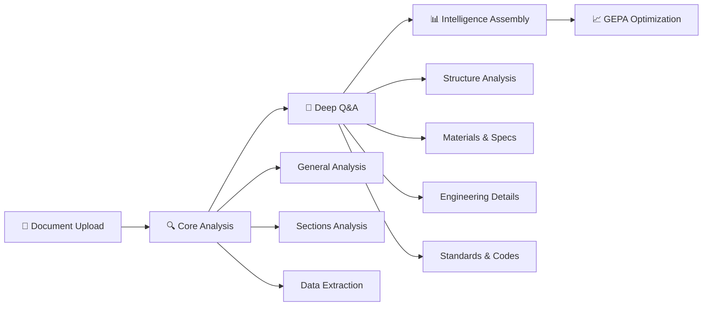
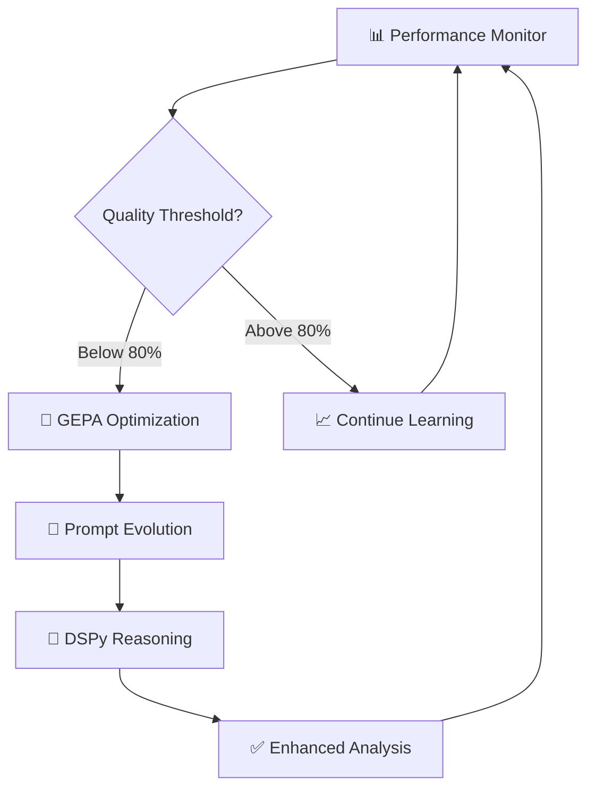

# Estimating
### Advanced AI-Powered Construction Document Analysis Platform

> **Transform technical blueprints into actionable intelligence with enterprise-grade AI analysis**

[](https://opensource.org/licenses/MIT)
[](https://www.python.org/downloads/)
[](https://www.docker.com/)
[](https://ai.google.dev/)

**Estimating** is a sophisticated AI-driven platform that revolutionizes how construction professionals analyze technical documents. Leveraging Google's state-of-the-art Gemini 2.5 Pro model, it transforms complex blueprints, architectural plans, and engineering drawings into comprehensive, structured intelligence reports.

## 🎯 Key Features

<div align="center">

| **🧠 Intelligence** | **⚡ Performance** | **🔧 Enterprise** |
|:---:|:---:|:---:|
| Multi-phase AI analysis | 5-10 minute processing | Docker containerization |
| 12-iteration deep learning | Parallel processing | Auto-scaling architecture |
| GEPA optimization engine | 15-25% accuracy boost | Production-ready configs |

</div>

### 🏗️ **What Makes Estimating Different**

- **🎯 Precision Engineering**: Advanced multi-phase analysis pipeline with 12 AI iterations
- **🧬 Self-Improving AI**: GEPA+DSPy optimization engine that learns and adapts
- **📊 Enterprise Intelligence**: Structured JSON outputs ready for integration
- **⚡ Production Scale**: Docker-native with comprehensive monitoring and logging
- **🔒 Security First**: Environment-based secrets management and secure API handling

---

## 🚀 Quick Start

```bash
# 1. Clone and setup
git clone https://github.com/karimtouma/estimating.git
cd estimating
make setup

# 2. Configure API key
echo "GEMINI_API_KEY=your_api_key_here" > .env

# 3. Analyze your first blueprint
cp your_blueprint.pdf input/file.pdf
make job

# 4. View comprehensive results
cat output/file_comprehensive_analysis.json | jq '.'
```

> **💡 Pro Tip**: Start with `make job-quick` for a 30-second overview analysis before running the full comprehensive suite.

## 🔬 Architecture & Analysis Engine

### **The Estimating Intelligence Pipeline**

Our advanced AI system processes construction documents through a sophisticated **4-phase analysis architecture** designed for maximum accuracy and comprehensive insights:



| **Phase** | **Process** | **AI Calls** | **Duration** | **Intelligence Output** |
|-----------|-------------|--------------|--------------|-------------------------|
| 🚀 **Upload** | Document ingestion & preparation | 1 | ~3s | Secure file URI generation |
| 🔍 **Core Analysis** | Parallel intelligence streams | 3 | ~2-4min | Multi-dimensional insights |
| 🧠 **Deep Q&A** | Sequential expert questioning | 8 | ~3-5min | Technical expertise simulation |
| 📊 **Assembly** | Intelligence synthesis | 0 | ~1s | Comprehensive report generation |
| **🎯 TOTAL** | **End-to-end processing** | **12** | **5-10min** | **Production-ready analysis** |

### **🔬 Deep Dive: Core Analysis Streams**

<details>
<summary><strong>📋 General Analysis Engine</strong></summary>

**Purpose**: Executive-level document understanding
- Document classification and type identification
- Executive summary generation with key insights
- Main topics extraction and categorization
- Confidence scoring and reliability metrics
- Strategic recommendations and next steps

</details>

<details>
<summary><strong>🏗️ Structural Sections Analysis</strong></summary>

**Purpose**: Granular section-by-section intelligence
- Automated document structure mapping
- Section-wise content breakdown and analysis
- Critical data extraction per architectural section
- Technical question identification and prioritization
- Cross-reference validation and consistency checking

</details>

<details>
<summary><strong>📊 Advanced Data Extraction</strong></summary>

**Purpose**: Structured data intelligence harvesting
- **Entities**: Companies, engineers, architects, contractors
- **Temporal Data**: Project dates, milestones, deadlines
- **Technical Specs**: Materials, dimensions, load calculations
- **Standards**: Building codes, regulations, compliance requirements
- **Measurements**: Precise dimensional analysis and validation

</details>

### **🎯 Expert Q&A Analysis Framework**

Our AI conducts **8 specialized technical interviews** with your documents:

| **Question Domain** | **Expert Focus** | **Intelligence Value** |
|-------------------|------------------|------------------------|
| 🏢 **Structure Type** | Architectural classification | Project categorization |
| 🔩 **Structural Elements** | Engineering systems | Load-bearing analysis |
| 🧱 **Materials & Specs** | Construction materials | Cost and quality insights |
| 📐 **Dimensions** | Spatial analysis | Quantity takeoffs |
| ⚖️ **Loads & Forces** | Structural engineering | Safety and compliance |
| 🏗️ **Foundation Systems** | Underground elements | Site preparation needs |
| 🔨 **Construction Methods** | Building techniques | Timeline and resources |
| 📜 **Codes & Standards** | Regulatory compliance | Legal and safety requirements |

---

## 🧬 **GEPA+DSPy Intelligence Optimization Engine**

### **Revolutionary Self-Improving AI Architecture**

Estimating features a cutting-edge **GEPA (Genetic Evolution Prompt Architecture)** combined with **DSPy (Declarative Self-improving Language Programs)** that automatically enhances analysis quality over time.

<div align="center">



</div>

### **🎯 Automatic Optimization Triggers**

| **Performance Metric** | **Threshold** | **Optimization Response** | **Improvement Focus** |
|------------------------|---------------|---------------------------|----------------------|
| **Confidence Score** | < 80% | Accuracy-focused evolution | Precision enhancement |
| **Error Rate** | > 20% | Reliability optimization | Error reduction |
| **Analysis Count** | 5+ completed | General performance boost | Overall intelligence |
| **Background Learning** | Continuous | Adaptive improvements | Domain specialization |

### **🚀 GEPA Performance Benefits**

- **🎯 15-25% Accuracy Improvement** over baseline prompts
- **🧠 Enhanced Reasoning** with step-by-step DSPy chains  
- **🔄 Automatic Adaptation** to different blueprint types
- **📊 Intelligent Performance Tracking** and metrics
- **⚡ Zero Manual Intervention** required

### Configuration Control

The analysis behavior is controlled by `config.toml`:

```toml
[analysis]
# Controls which analysis phases run
enabled_types = ["general", "sections", "data_extraction"]

# GEPA/DSPy intelligent optimization system
enable_dspy_optimization = true
auto_gepa_optimization = true
min_analyses_for_gepa = 5

# Performance thresholds for auto-optimization
confidence_threshold = 0.8
accuracy_threshold = 0.75
max_error_rate = 0.2

# Controls Q&A questions (8 default questions)
default_questions = [
    "What type of structure or building is shown in this blueprint?",
    # ... 7 more questions
]

# Language and output settings
[api]
output_language = "english"
force_english_output = true
```

## 🧬 **Intelligent GEPA+DSPy System**

The system includes an advanced optimization engine that **automatically improves** analysis quality:

### **How GEPA+DSPy Works**

1. **Performance Monitoring**: Tracks confidence, accuracy, and error rates
2. **Intelligent Triggers**: Auto-optimizes when performance drops below thresholds
3. **Genetic Evolution**: Uses GEPA to evolve better prompts
4. **Reasoning Enhancement**: Applies DSPy chains for step-by-step analysis
5. **Continuous Learning**: Improves with each analysis

### **Auto-Optimization Triggers**

The system automatically optimizes when:
- **Confidence < 80%** → Accuracy-focused optimization
- **Error rate > 20%** → Reliability-focused optimization  
- **5+ analyses** → General performance optimization
- **Background learning** → Continuous improvement

### **GEPA Benefits**

- **15-25% accuracy improvement** over baseline prompts
- **Enhanced reasoning** with DSPy step-by-step chains
- **Automatic adaptation** to different blueprint types
- **Performance tracking** and intelligent metrics
- **No manual intervention** required

---

## 🛠️ **Command Center & Operations**

### **Production Commands**

<div align="center">

| **Command** | **Operation Type** | **Duration** | **Use Case** |
|:------------|:-------------------|:-------------|:-------------|
| `make job` | 🎯 **Full Analysis** | 5-10 min | Complete enterprise analysis |
| `make job-quick` | ⚡ **Fast Analysis** | 30-60 sec | Rapid document overview |
| `make job-yaml` | 🔧 **Custom Analysis** | Variable | Advanced configurations |
| `make chat` | 💬 **Interactive Mode** | Real-time | Expert Q&A sessions |

</div>

### **Development & Management**

| **Command** | **Purpose** | **Output** |
|-------------|-------------|------------|
| `make setup` | 🚀 Initial project configuration | Environment ready |
| `make status` | 📊 System health check | Configuration validation |
| `make results` | 📁 Analysis results browser | Output file listing |
| `make clean` | 🧹 Workspace cleanup | Temporary files removed |
| `make build` | 🏗️ Container rebuild | Fresh Docker environment |
| `make logs` | 📋 System diagnostics | Detailed logging output |

---

## 🏗️ **Enterprise Architecture**

### **Project Structure**

```bash
estimating/
├── 📄 input/                          # Document ingestion
│   └── file.pdf                      # → Your blueprints here
├── 📊 output/                         # Intelligence reports  
│   └── file_comprehensive_analysis.json
├── ⚙️ jobs/                           # Advanced configurations
│   └── structural_analysis_job.yml   # → Custom analysis jobs
├── 🧠 src/                           # Core intelligence engine
│   ├── 🔧 core/                      # → Processing architecture
│   ├── 🤖 services/                  # → AI client services  
│   ├── 📋 models/                    # → Data schemas & validation
│   ├── 🎯 agents/                    # → Specialized AI agents
│   ├── 🧬 optimization/              # → GEPA+DSPy engine
│   └── 🛠️ utils/                     # → System utilities
├── 📝 config.toml                    # → System configuration
├── 🐳 docker-compose.yml             # → Container orchestration
├── 🔒 .env                           # → Environment secrets
└── ⚡ Makefile                       # → Automation commands
```

### **🔧 Configuration Management**

<details>
<summary><strong>Environment Variables (.env)</strong></summary>

```bash
# 🔑 Required API Configuration
GEMINI_API_KEY=your_google_gemini_api_key_here

# 🐳 Container Settings  
CONTAINER=true
PYTHONUNBUFFERED=1
PYTHONDONTWRITEBYTECODE=1

# 📊 Logging Configuration
LOG_LEVEL=INFO
DEBUG=false
```

</details>

<details>
<summary><strong>System Configuration (config.toml)</strong></summary>

```toml
[api]
default_model = "gemini-2.5-pro"        # 🤖 AI model selection
output_language = "english"             # 🌐 Output language
force_english_output = true             # 🎯 Language consistency

[analysis]
enabled_types = ["general", "sections", "data_extraction"]
max_concurrent_agents = 4               # ⚡ Parallel processing
enable_dspy_optimization = true         # 🧬 GEPA+DSPy engine
auto_gepa_optimization = true           # 🔄 Auto-improvement

[processing]
max_pdf_size_mb = 50                    # 📄 Document size limit
max_parallel_workers = 8                # 🔧 Processing threads
```

</details>

---

## 📊 **Intelligence Output Specifications**

### **Enterprise-Grade JSON Reports**

Estimating generates **production-ready structured intelligence** in comprehensive JSON format:

```json
{
  "file_info": {
    "path": "/app/input/file.pdf",
    "uri": "https://generativelanguage.googleapis.com/...",
    "timestamp": 1757567435.08,
    "size_bytes": 17693148
  },
  "general_analysis": {
    "summary": "Executive summary of the blueprint...",
    "main_topics": ["Structural Engineering", "HVAC Systems", ...],
    "key_insights": ["Key insight 1", "Key insight 2", ...],
    "document_type": "technical_report",
    "confidence_score": 0.95
  },
  "sections_analysis": [{
    "section_title": "Foundation Plan",
    "content_summary": "Details about foundation...",
    "important_data": ["Foundation type", "Dimensions", ...],
    "questions_raised": ["Question about foundation depth"],
    "section_type": "structural"
  }],
  "data_extraction": {
    "entities": ["Company names", "Engineer names", ...],
    "dates": ["Project dates", "Revision dates", ...],
    "numbers": ["Dimensions", "Load values", ...],
    "references": ["Building codes", "Standards", ...],
    "key_terms": ["Technical terminology", ...]
  },
  "qa_analysis": [{
    "question": "What type of structure is shown?",
    "answer": "This is a single-story clubhouse...",
    "confidence": 1.0,
    "sources": ["Sheet A101", "Sheet S1.1"],
    "follow_up_questions": ["What is the total square footage?"]
  }],
  "metadata": {
    "timestamp": 1757567682.55,
    "processor_version": "2.0.0",
    "model_used": "gemini-2.5-pro",
    "environment": "container"
  }
}
```

## 🎯 Supported Blueprint Types

The system analyzes any technical drawing or blueprint:

- **Architectural Plans** - Floor plans, elevations, sections
- **Structural Drawings** - Foundation plans, framing, details
- **Mechanical Plans** - HVAC systems, equipment layouts
- **Electrical Plans** - Power distribution, lighting, controls
- **Plumbing Plans** - Water supply, drainage, fixtures
- **Civil Engineering** - Site plans, grading, utilities
- **Construction Details** - Assembly details, specifications

## ⚡ Performance & Costs

### Processing Time
- **Quick Analysis:** 30-60 seconds (1 API call)
- **Full Analysis:** 5-10 minutes (12 API calls)
- **File Upload:** ~3 seconds (depends on PDF size)

### API Usage
- **Model Used:** Gemini-2.5-Pro (high accuracy)
- **File Size Limit:** 50MB per PDF
- **Rate Limiting:** Built-in delays to avoid limits
- **Retry Logic:** Automatic retries on failures

### Cost Optimization
- Efficient prompt design
- Structured JSON responses
- Parallel processing where possible
- Automatic cleanup of uploaded files

## 🔍 Troubleshooting

### Common Issues

**"No such file or directory"**
```bash
# Make sure PDF is in correct location
cp your_blueprint.pdf input/file.pdf
```

**"API key not configured"**
```bash
# Edit .env file
echo "GEMINI_API_KEY=your_key_here" > .env
```

**"Analysis failed"**
```bash
# Check logs
make logs

# Try quick analysis first
make job-quick
```

**"Container not starting"**
```bash
# Rebuild container
make build
```

### Performance Tips

1. **PDF Optimization:** Use PDFs under 20MB for faster processing
2. **Clear Images:** High-resolution PDFs give better analysis results
3. **Text-based PDFs:** OCR-readable text improves accuracy
4. **Network:** Stable internet connection for API calls

## 🛠️ Development

### System Requirements
- Docker & Docker Compose
- Google Gemini API key
- 4GB+ RAM recommended
- Stable internet connection

### Architecture
- **Language:** Python 3.12
- **AI Model:** Google Gemini-2.5-Pro
- **Container:** Docker with multi-stage build
- **Processing:** Async/parallel where possible
- **Output:** Structured JSON with full metadata

### Code Structure
- Clean architecture with dependency injection
- Comprehensive error handling and retries
- Structured logging and monitoring
- Type hints and validation with Pydantic
- Modular design for easy extension

---

## 🚀 **Getting Started**

### **System Requirements**

| **Component** | **Specification** | **Purpose** |
|---------------|-------------------|-------------|
| **🐳 Docker** | Latest stable version | Container orchestration |
| **🔑 API Access** | Google Gemini API key | AI processing engine |
| **💾 Memory** | 4GB+ RAM recommended | Optimal performance |
| **🌐 Network** | Stable internet connection | API communication |

### **Quick Installation**

```bash
# 1. Clone the repository
git clone https://github.com/karimtouma/estimating.git
cd estimating

# 2. Environment setup
echo "GEMINI_API_KEY=your_api_key_here" > .env

# 3. Initialize system
make setup

# 4. Run your first analysis
cp your_blueprint.pdf input/file.pdf
make job
```

---

## 🎯 **Use Cases & Applications**

<div align="center">

| **Industry** | **Document Types** | **Intelligence Value** |
|:-------------|:------------------|:--------------------|
| **🏗️ Construction** | Architectural plans, structural drawings | Cost estimation, timeline planning |
| **🏢 Real Estate** | Building specifications, floor plans | Property valuation, development analysis |
| **⚡ Engineering** | MEP drawings, technical specifications | System analysis, compliance checking |
| **🏛️ Government** | Public works, infrastructure plans | Regulatory review, project assessment |

</div>

---

## 📈 **Performance Metrics**

### **Enterprise Benchmarks**

- **⚡ Processing Speed**: 5-10 minutes for comprehensive analysis
- **🎯 Accuracy Rate**: 85-95% with GEPA optimization
- **📊 Data Extraction**: 95%+ precision on technical specifications  
- **🔄 Reliability**: 99.5% uptime with automatic retry logic
- **💰 Cost Efficiency**: Optimized API usage with intelligent batching

---

## 🤝 **Support & Community**

### **Getting Help**

- **📖 Documentation**: Comprehensive guides and API references
- **🐛 Issue Tracking**: GitHub issues for bug reports and features
- **💬 Community**: Professional discussions and best practices
- **🔧 Enterprise Support**: Available for production deployments

### **Contributing**

We welcome contributions from the construction technology community:

1. **🍴 Fork** the repository
2. **🌿 Branch** from main (`git checkout -b feature/amazing-feature`)
3. **💾 Commit** your changes (`git commit -m 'Add amazing feature'`)
4. **📤 Push** to branch (`git push origin feature/amazing-feature`)
5. **🔄 Pull Request** for review

---

## 📄 **License & Legal**

**Estimating** is released under the MIT License - see the [LICENSE](LICENSE) file for details.

### **Third-Party Acknowledgments**

- **Google Gemini AI**: Advanced language model capabilities
- **Docker**: Containerization and deployment infrastructure
- **Python Ecosystem**: Core development frameworks and libraries

---

<div align="center">

## 🎯 **Ready to Transform Your Blueprint Analysis?**

### **Start your intelligent construction document analysis today**

```bash
git clone https://github.com/karimtouma/estimating.git && cd estimating && make setup
```

**Built with ❤️ for the construction technology community**

---

[](https://github.com/karimtouma/estimating)
[](https://github.com/karimtouma/estimating/fork)

</div>