# Estimador
### Plataforma Avanzada de Análisis de Documentos de Construcción Impulsada por IA

> **Transforma planos técnicos en inteligencia accionable con análisis de IA de nivel empresarial**

[](https://opensource.org/licenses/MIT)
[](https://www.python.org/downloads/)
[](https://www.docker.com/)
[](https://ai.google.dev/)
[](https://dspy.ai/)
[](https://github.com/karimtouma/estimate)

**Estimador v2.1.0** es una plataforma impulsada por IA para el análisis de documentos técnicos de construcción. Utiliza el modelo Gemini 2.5 Flash de Google con integración DSPy para detección de alucinaciones, procesando planos, planes arquitectónicos y dibujos de ingeniería en informes estructurados en formato JSON.

## 🎯 Características Clave

<div align="center">

| **🧠 Inteligencia** | **⚡ Rendimiento** | **🔧 Empresarial** |
|:---:|:---:|:---:|
| Detección de patrones repetitivos | Procesamiento en minutos | Contenedorización Docker |
| Sistema de exploración de documentos | Reutilización de cache | Configuración modular |
| Optimización de prompts | Reducción de llamadas API | Entorno de producción |

</div>

### 🏗️ **Características de Estimador v2.1.0**

- **🛡️ Detección de Alucinaciones**: Implementa DSPy para identificar patrones repetitivos y contenido generado erróneamente
- **🎯 Pipeline de Análisis**: Sistema multifase que procesa documentos a través de diferentes etapas de extracción
- **🚀 Exploración de Documentos**: Analiza múltiples páginas del documento para obtener una visión completa
- **⚡ Procesamiento por Lotes**: Agrupa múltiples consultas en llamadas API únicas para mejorar eficiencia
- **🧠 Sistema de Caché**: Reutiliza tokens y resultados previos cuando es posible
- **🧬 Optimización Adaptativa**: Motor GEPA que ajusta prompts basado en resultados previos
- **📊 Seguimiento de Métricas**: Registra tokens utilizados, tiempo de procesamiento y costos estimados
- **💰 Gestión de Costos**: Optimiza el uso de API para reducir gastos operativos
- **🔒 Configuración Segura**: Maneja claves API y secretos a través de variables de entorno

---

## 🚀 Inicio Rápido

```bash
# 1. Clonar y configurar
git clone https://github.com/karimtouma/estimate.git
cd estimate
make setup

# 2. Configurar clave API
echo "GEMINI_API_KEY=tu_clave_api_aqui" > .env

# 3. Analizar tu primer plano
cp tu_plano.pdf input/file.pdf
make job

# 4. Ver resultados completos
cat output/file_comprehensive_analysis.json | jq '.'
```

> **💡 Consejo Pro**: Comienza con `make job-quick` para un análisis de resumen de 30 segundos antes de ejecutar la suite completa.

## 📚 **Tecnologías Clave Explicadas**

### **🧬 ¿Qué es DSPy y para qué se usa?**

**DSPy (Declarative Self-improving Language Programs)** es un framework desarrollado por Stanford que permite crear programas de lenguaje natural que se mejoran automáticamente.

**📚 Referencia Académica:** Khattab, O., et al. (2023). "DSPy: Compiling Declarative Language Model Calls into Self-Improving Pipelines." *arXiv:2310.03714*

**En nuestro contexto:**

**🎯 Propósito en Estimador:**
- **Detección de Alucinaciones**: Identifica cuando la IA genera contenido repetitivo o inconsistente
- **Validación de Respuestas**: Verifica que las respuestas generadas sean coherentes y relevantes
- **Mejora Iterativa**: Aprende de errores previos para mejorar futuras respuestas
- **Estructura Tipada**: Garantiza que las salidas cumplan con formatos específicos

**🔧 Cómo funciona:**
```python
# Ejemplo de firma DSPy para validación
class ValidateAnalysis(dspy.Signature):
    analysis_text: str = dspy.InputField(desc="Texto de análisis a validar")
    is_valid: bool = dspy.OutputField(desc="Si el análisis es válido")
    confidence: float = dspy.OutputField(desc="Nivel de confianza 0-1")
    issues_found: list = dspy.OutputField(desc="Problemas detectados")
```

### **🧬 ¿Qué es GEPA y para qué se usa?**

**GEPA (Genetic Evolution Prompt Architecture)** es nuestro sistema propietario que utiliza algoritmos evolutivos para optimizar prompts de IA.

**📚 Fundamento Teórico:** Basado en algoritmos genéticos (Holland, 1992) y optimización evolutiva de prompts (Fernando et al., 2023). *Ver referencias académicas completas al final del documento.*

**🎯 Propósito en Estimador:**
- **Optimización de Prompts**: Mejora automáticamente las instrucciones dadas a la IA
- **Adaptación por Dominio**: Se especializa en documentos de construcción específicos
- **Aprendizaje Continuo**: Evoluciona basado en resultados de análisis previos
- **Reducción de Errores**: Minimiza respuestas irrelevantes o incorrectas

**🔧 Cómo funciona:**
1. **Generación**: Crea variaciones de prompts base
2. **Evaluación**: Mide la calidad de respuestas obtenidas
3. **Selección**: Identifica los prompts más efectivos
4. **Mutación**: Genera nuevas variaciones de los mejores prompts
5. **Iteración**: Repite el proceso para mejora continua

### **🧠 ¿Qué es Chain-of-Thought y para qué se usa?**

**Chain-of-Thought (CoT)** es una técnica que hace que la IA "piense en voz alta" mostrando su proceso de razonamiento.

**📚 Referencia Académica:** Wei, J., et al. (2022). "Chain-of-Thought Prompting Elicits Reasoning in Large Language Models." *arXiv:2201.11903*

**🎯 Propósito en Estimador:**
- **Razonamiento Transparente**: Muestra cómo la IA llega a sus conclusiones
- **Mejor Precisión**: Reduce errores al forzar análisis paso a paso
- **Detección de Problemas**: Permite identificar dónde falla el razonamiento
- **Confianza del Usuario**: Proporciona justificación para las respuestas

**🔧 Ejemplo de aplicación:**
```
Pregunta: "¿Qué tipo de estructura se muestra en este plano?"

Razonamiento CoT:
1. "Observo que hay múltiples niveles indicados..."
2. "Las dimensiones sugieren uso residencial..."
3. "Los símbolos de plomería indican baños y cocina..."
4. "Por tanto, se trata de un edificio residencial multifamiliar"
```

### **🤖 ¿Qué es Gemini y para qué se usa?**

**Gemini** es el modelo de IA multimodal de Google que puede procesar tanto texto como imágenes simultáneamente.

**📚 Referencia Académica:** Google DeepMind Team. (2023). "Gemini: A Family of Highly Capable Multimodal Models." *arXiv:2312.11805*

**🎯 Propósito en Estimador:**
- **Análisis Visual**: Interpreta diagramas, planos y esquemas directamente
- **Comprensión Contextual**: Relaciona elementos visuales con descripciones textuales
- **Extracción de Datos**: Identifica números, medidas y anotaciones en planos
- **Clasificación de Elementos**: Reconoce símbolos arquitectónicos y de ingeniería

**🔧 Capacidades clave:**
- Procesa PDFs con imágenes y texto
- Identifica elementos gráficos complejos
- Mantiene contexto entre múltiples páginas
- Genera respuestas estructuradas en JSON

### **🔄 ¿Cómo trabajan juntas estas tecnologías?**

```mermaid
graph TD
    A[Documento PDF] --> B[Gemini: Análisis Multimodal]
    B --> C[Chain-of-Thought: Razonamiento]
    C --> D[DSPy: Validación y Limpieza]
    D --> E[GEPA: Optimización Continua]
    E --> F[Resultado Final Validado]
    
    E --> G[Aprendizaje para Futuros Análisis]
    G --> B
```



**🔄 Flujo de trabajo integrado:**
1. **Gemini** analiza el documento visual y textualmente
2. **Chain-of-Thought** estructura el razonamiento paso a paso
3. **DSPy** valida la coherencia y detecta problemas
4. **GEPA** aprende de los resultados para mejorar futuros análisis
5. El ciclo se repite, mejorando continuamente la precisión

---

## 🔬 Arquitectura y Motor de Análisis

### **El Pipeline de Inteligencia Estimador v2.0**

El sistema procesa documentos de construcción a través de una arquitectura de 5 fases con descubrimiento de contenido y procesamiento por lotes:

```mermaid
graph LR
    A[📄 Carga de Documento] --> B[🔍 Fase de Descubrimiento]
    B --> C[🧠 Análisis Central]
    C --> D[💬 P&R por Lotes]
    D --> E[📊 Ensamblaje de Inteligencia]
    E --> F[📈 Optimización GEPA]
    
    B --> B1[Caché Inteligente]
    B --> B2[Muestreo Adaptativo]
    B --> B3[Reconocimiento de Patrones]
    
    C --> C1[Análisis General]
    C --> C2[Análisis de Secciones] 
    C --> C3[Extracción de Datos]
    
    D --> D1[Procesamiento por Lotes]
    D --> D2[Preguntas Paralelas]
    D --> D3[Limitación de Velocidad]
```



| **Fase** | **Proceso** | **Llamadas IA** | **Duración** | **Salida de Inteligencia** |
|-----------|-------------|--------------|--------------|-------------------------|
| 🚀 **Carga** | Ingestión y preparación de documento | 1 | ~3s | Generación de URI de archivo seguro |
| 🔍 **Descubrimiento** | **Exploración adaptativa de documento** | **1** | **~45s** | **Mapeo de estructura de documento** |
| 🧠 **Análisis Central** | Flujos de inteligencia paralelos | 3 | ~2min | Perspectivas multidimensionales |
| 💬 **P&R por Lotes** | **Cuestionamiento por lotes optimizado** | **1** | **~50s** | **Simulación de experiencia técnica** |
| 📊 **Ensamblaje** | Síntesis de inteligencia | 0 | ~1s | Generación de informe completo |
| **🎯 TOTAL** | **Procesamiento de extremo a extremo** | **6** | **3-4min** | **Análisis listo para producción** |

### **🚀 Nuevo en v2.1.0: Integración DSPy e Inteligencia Mejorada**

<details>
<summary><strong>🎯 Detección de Alucinaciones Impulsada por DSPy (NUEVO v2.1.0)</strong></summary>

**Detección de alucinaciones type-safe usando el framework DSPy**
- **Firmas Tipadas**: Detección fuertemente tipada con puntuaciones de confianza
- **Razonamiento Chain-of-Thought**: Razonamiento paso a paso para detección contextual
- **Limpieza Inteligente**: Preserva contenido válido mientras elimina alucinaciones
- **Validación Específica por Campo**: Límites y reglas personalizados por campo de datos
- **Sistema de Respaldo**: Sistema robusto basado en regex cuando DSPy no está disponible

```python
# Firmas DSPy para detección
class DetectRepetitiveHallucination(dspy.Signature):
    text: str = dspy.InputField(desc="Texto a analizar")
    has_repetition: bool = dspy.OutputField(desc="Alucinación detectada")
    pattern_found: str = dspy.OutputField(desc="Patrón si se encuentra")
    confidence: float = dspy.OutputField(desc="Confianza 0-1")

# Chain-of-Thought para mejor razonamiento
detector = HallucinationDetector()
has_hallucination, cleaned_text = detector.detect_and_clean(text)
# Elimina automáticamente patrones como "-item-item-item..." preservando contenido válido
```

**Beneficios:**
- ✅ Detecta patrones repetitivos y contenido potencialmente erróneo
- ✅ Preserva datos válidos mientras limpia texto corrupto
- ✅ Type-safe con integración Pydantic
- ✅ Explica razonamiento a través de Chain-of-Thought

**Referencias Académicas:**
- **DSPy Framework**: Khattab, O., et al. (2023). "DSPy: Compiling Declarative Language Model Calls into Self-Improving Pipelines." *arXiv preprint arXiv:2310.03714*. [https://arxiv.org/abs/2310.03714](https://arxiv.org/abs/2310.03714)
- **Chain-of-Thought**: Wei, J., et al. (2022). "Chain-of-Thought Prompting Elicits Reasoning in Large Language Models." *arXiv preprint arXiv:2201.11903*. [https://arxiv.org/abs/2201.11903](https://arxiv.org/abs/2201.11903)
- **Detección de Alucinaciones**: Manakul, P., et al. (2023). "SelfCheckGPT: Zero-Resource Black-Box Hallucination Detection for Generative Large Language Models." *arXiv preprint arXiv:2303.08896*. [https://arxiv.org/abs/2303.08896](https://arxiv.org/abs/2303.08896)
</details>

<details>
<summary><strong>🔍 Sistema de Descubrimiento Adaptativo (FASE 1)</strong></summary>

**Exploración de documentos sin taxonomías predefinidas**
- **Caché Inteligente**: Pre-carga páginas críticas (primera, última, media) para acceso instantáneo
- **Muestreo Adaptativo**: Analiza un subconjunto representativo de páginas del documento
- **Cobertura Adaptativa**: Ajusta el número de páginas analizadas según el tamaño del documento
- **Procesamiento por Lotes**: Agrupa múltiples consultas en llamadas API únicas
- **Reconocimiento de Patrones**: Identificación de estructura de documento y nomenclatura

**Beneficio**: Reduce el tiempo total de procesamiento al explorar el documento de manera más eficiente

**Referencias Académicas:**
- **Análisis de Documentos Técnicos**: Chen, L., et al. (2023). "Automated Construction Document Analysis Using Deep Learning Techniques." *Journal of Construction Engineering and Management*, 149(8). DOI: 10.1061/JCEMD4.COENG-13245
- **Procesamiento de Documentos Multimodales**: Li, J., et al. (2023). "Multimodal Document Understanding for Construction Industry Applications." *Computer-Aided Civil and Infrastructure Engineering*, 38(12), 1623-1640.
</details>

<details>
<summary><strong>⚡ Procesamiento Inteligente por Lotes</strong></summary>

**Utilización optimizada de API con procesamiento paralelo**
- **Optimización Multi-turno**: 8 preguntas procesadas en 1 llamada API vs. 8 llamadas secuenciales
- **Limitación de Velocidad**: Control de concurrencia basado en semáforos
- **Sistemas de Respaldo**: Degradación automática a procesamiento secuencial si falla el lote
- **Resistencia a Errores**: Manejo robusto de errores con reintentos automáticos

**Beneficio**: Mejora la eficiencia al procesar múltiples preguntas simultáneamente

**Referencias Académicas:**
- **Procesamiento Paralelo en IA**: Zhang, Y., et al. (2023). "Efficient Parallel Processing Techniques for Large Language Model Inference." *Proceedings of the International Conference on Machine Learning*, 40, 28456-28470.
</details>

<details>
<summary><strong>🧠 Arquitectura de Caché Inteligente</strong></summary>

**Gestión de páginas para optimización de rendimiento**
- **Estrategia de Pre-caché**: Páginas críticas cargadas durante inicialización
- **Puntuación de Complejidad**: Cálculo de complejidad visual con caché
- **Optimización de Memoria**: Gestión eficiente de caché con seguimiento de metadatos
- **Acceso Instantáneo**: Páginas en caché accesibles sin re-procesamiento

**Impacto en Rendimiento**: Acceso instantáneo a páginas frecuentemente utilizadas

</details>

<details>
<summary><strong>🗺️ Sistema Completo de Mapeo de Páginas</strong></summary>

**Análisis y categorización exhaustiva página por página**
- **Análisis Completo**: Procesa todas las páginas del documento según configuración
- **Categorización Inteligente**: Mapea cada página a temas principales del análisis general
- **Lotes Inteligentes**: Procesa 5 páginas por llamada API para eficiencia óptima
- **Procesamiento Paralelo**: 2 lotes concurrentes con limitación de velocidad
- **Metadatos Ricos**: Resúmenes de página, elementos clave, puntuaciones de complejidad, niveles de confianza
- **Análisis de Cobertura**: Distribución y análisis de alcance para cada categoría de tema

**Impacto en Rendimiento**: Mapeo completo de documento con perspectivas granulares de página

**Ejemplo de Salida JSON**:
```json
{
  "page_map": {
    "total_pages": 51,
    "pages": [
      {
        "page_number": 1,
        "primary_category": "Diseño Arquitectónico y Plano de Sitio",
        "secondary_categories": ["Cumplimiento de Código de Construcción"],
        "content_summary": "Hoja de portada con información del proyecto",
        "key_elements": ["Título del proyecto", "Índice de dibujos"],
        "complexity_score": 0.3,
        "confidence": 0.95
      }
    ],
    "category_distribution": {
      "Diseño Arquitectónico": [1, 2, 5, 8],
      "Ingeniería Estructural": [15, 16, 17, 18],
      "Sistemas MEP": [25, 26, 27, 28, 29]
    },
    "coverage_analysis": {
      "Diseño Arquitectónico": {
        "total_pages": 8,
        "coverage_percentage": 15.7,
        "page_range": {"first": 1, "last": 19}
      }
    }
  }
}
```

</details>

### **🔬 Inmersión Profunda: Flujos de Análisis Central**

<details>
<summary><strong>📋 Motor de Análisis General</strong></summary>

**Propósito**: Comprensión de documento a nivel ejecutivo
- Clasificación de documento e identificación de tipo
- Generación de resumen ejecutivo con perspectivas clave
- Extracción y categorización de temas principales
- Puntuación de confianza y métricas de confiabilidad
- Recomendaciones estratégicas y próximos pasos

</details>

<details>
<summary><strong>🏗️ Análisis Estructural de Secciones</strong></summary>

**Propósito**: Inteligencia granular sección por sección
- Mapeo automatizado de estructura de documento
- Desglose y análisis de contenido por sección
- Extracción de datos críticos por sección arquitectónica
- Identificación y priorización de preguntas técnicas
- Validación de referencias cruzadas y verificación de consistencia

</details>

<details>
<summary><strong>📊 Extracción Avanzada de Datos</strong></summary>

**Propósito**: Cosecha de inteligencia de datos estructurados
- **Entidades**: Empresas, ingenieros, arquitectos, contratistas
- **Datos Temporales**: Fechas de proyecto, hitos, plazos
- **Especificaciones Técnicas**: Materiales, dimensiones, cálculos de carga
- **Estándares**: Códigos de construcción, regulaciones, requisitos de cumplimiento
- **Mediciones**: Análisis dimensional preciso y validación

</details>

### **🎯 Framework de Análisis P&R Experto**

Nuestra IA conduce **8 entrevistas técnicas especializadas** con tus documentos:

| **Dominio de Pregunta** | **Enfoque Experto** | **Valor de Inteligencia** |
|-------------------|------------------|------------------------|
| 🏢 **Tipo de Estructura** | Clasificación arquitectónica | Categorización de proyecto |
| 🔩 **Elementos Estructurales** | Sistemas de ingeniería | Análisis de carga estructural |
| 🧱 **Materiales y Especificaciones** | Materiales de construcción | Perspectivas de costo y calidad |
| 📐 **Dimensiones** | Análisis espacial | Cuantificación de cantidades |
| ⚖️ **Cargas y Fuerzas** | Ingeniería estructural | Seguridad y cumplimiento |
| 🏗️ **Sistemas de Cimentación** | Elementos subterráneos | Necesidades de preparación de sitio |
| 🔨 **Métodos de Construcción** | Técnicas de construcción | Cronograma y recursos |
| 📜 **Códigos y Estándares** | Cumplimiento regulatorio | Requisitos legales y de seguridad |

---

## 🧬 **Motor de Optimización de Inteligencia GEPA+DSPy**

### **Arquitectura Revolucionaria de IA Auto-mejorable**

Estimador cuenta con un **GEPA (Arquitectura de Evolución Genética de Prompts)** de vanguardia combinado con **DSPy (Programas Declarativos de Lenguaje Auto-mejorables)** que mejora automáticamente la calidad del análisis con el tiempo.

```mermaid
graph TB
    A[📊 Monitor de Rendimiento] --> B{¿Umbral de Calidad?}
    B -->|Debajo 80%| C[🧬 Optimización GEPA]
    B -->|Arriba 80%| D[📈 Continuar Aprendiendo]
    C --> E[🔄 Evolución de Prompts]
    E --> F[🧠 Razonamiento DSPy]
    F --> G[✅ Análisis Mejorado]
    G --> A
    D --> A
```

<div align="center">



</div>

### **🎯 Disparadores de Optimización Automática**

| **Métrica de Rendimiento** | **Umbral** | **Respuesta de Optimización** | **Enfoque de Mejora** |
|------------------------|---------------|---------------------------|----------------------|
| **Puntuación de Confianza** | < 80% | Evolución enfocada en precisión | Mejora de precisión |
| **Tasa de Error** | > 20% | Optimización de confiabilidad | Reducción de errores |
| **Conteo de Análisis** | 5+ completados | Impulso de rendimiento general | Inteligencia general |
| **Aprendizaje de Fondo** | Continuo | Mejoras adaptativas | Especialización de dominio |

### **🚀 Beneficios de Rendimiento GEPA**

- **🎯 Mejora de Precisión** mediante optimización iterativa de prompts
- **🧠 Razonamiento Mejorado** con cadenas DSPy paso a paso  
- **🔄 Adaptación Automática** a diferentes tipos de planos
- **📊 Seguimiento Inteligente de Rendimiento** y métricas
- **⚡ Cero Intervención Manual** requerida

### Control de Configuración

El comportamiento del análisis se controla por `config.toml`:

```toml
[analysis]
# Controla qué fases de análisis se ejecutan
enabled_types = ["general", "sections", "data_extraction"]

# Sistema de optimización GEPA/DSPy
enable_dspy_optimization = true
auto_gepa_optimization = true
min_analyses_for_gepa = 5

# Umbrales de rendimiento para auto-optimización
confidence_threshold = 0.8
accuracy_threshold = 0.75
max_error_rate = 0.2

# Controla preguntas P&R (8 preguntas por defecto)
default_questions = [
    "¿Qué tipo de estructura o edificio se muestra en este plano?",
    # ... 7 preguntas más
]

# Configuraciones de idioma y salida
[api]
output_language = "spanish"
force_spanish_output = true
```

**Referencias Académicas:**
- **Algoritmos Genéticos**: Holland, J. H. (1992). "Adaptation in Natural and Artificial Systems: An Introductory Analysis with Applications to Biology, Control, and Artificial Intelligence." MIT Press.
- **Optimización Evolutiva de Prompts**: Fernando, C., et al. (2023). "Promptbreeder: Self-Referential Self-Improvement Via Prompt Evolution." *arXiv preprint arXiv:2309.16797*. [https://arxiv.org/abs/2309.16797](https://arxiv.org/abs/2309.16797)
- **Auto-mejora en Modelos de Lenguaje**: Huang, J., et al. (2023). "Large Language Models Can Self-Improve." *arXiv preprint arXiv:2210.11610*. [https://arxiv.org/abs/2210.11610](https://arxiv.org/abs/2210.11610)

---

## 🛠️ **Centro de Comando y Operaciones**

### **Comandos de Producción**

<div align="center">

| **Comando** | **Tipo de Operación** | **Duración** | **Caso de Uso** |
|:------------|:-------------------|:-------------|:-------------|
| `make job` | 🎯 **Análisis Completo** | 5-10 min | Análisis empresarial completo |
| `make job-quick` | ⚡ **Análisis Rápido** | 30-60 seg | Resumen rápido de documento |
| `make job-yaml` | 🔧 **Análisis Personalizado** | Variable | Configuraciones avanzadas |
| `make chat` | 💬 **Modo Interactivo** | Tiempo real | Sesiones de P&R expertas |

</div>

### **Desarrollo y Gestión**

| **Comando** | **Propósito** | **Salida** |
|-------------|-------------|------------|
| `make setup` | 🚀 Configuración inicial del proyecto | Entorno listo |
| `make status` | 📊 Verificación de salud del sistema | Validación de configuración |
| `make results` | 📁 Navegador de resultados de análisis | Listado de archivos de salida |
| `make clean` | 🧹 Limpieza de espacio de trabajo | Archivos temporales eliminados |
| `make build` | 🏗️ Reconstrucción de contenedor | Entorno Docker fresco |
| `make logs` | 📋 Diagnósticos del sistema | Salida de logging detallada |

---

## 🏗️ **Arquitectura Empresarial**

### **Estructura del Proyecto**

```bash
estimador/
├── 📄 input/                          # Ingestión de documentos
│   └── file.pdf                      # → Tus planos aquí
├── 📊 output/                         # Informes de inteligencia  
│   └── file_comprehensive_analysis.json
├── ⚙️ jobs/                           # Configuraciones avanzadas
│   └── structural_analysis_job.yml   # → Trabajos de análisis personalizados
├── 🧠 src/                           # Motor de inteligencia central
│   ├── 🔧 core/                      # → Arquitectura de procesamiento
│   ├── 🤖 services/                  # → Servicios de cliente IA  
│   ├── 📋 models/                    # → Esquemas y validación de datos
│   ├── 🎯 agents/                    # → Agentes IA especializados
│   ├── 🧬 optimization/              # → Motor GEPA+DSPy
│   └── 🛠️ utils/                     # → Utilidades del sistema
├── 📝 config.toml                    # → Configuración del sistema
├── 🐳 docker-compose.yml             # → Orquestación de contenedores
├── 🔒 .env                           # → Secretos de entorno
└── ⚡ Makefile                       # → Comandos de automatización
```

### **🔧 Gestión de Configuración**

<details>
<summary><strong>Variables de Entorno (.env)</strong></summary>

```bash
# 🔑 Configuración API Requerida
GEMINI_API_KEY=tu_clave_api_google_gemini_aqui

# 🐳 Configuraciones de Contenedor  
CONTAINER=true
PYTHONUNBUFFERED=1
PYTHONDONTWRITEBYTECODE=1

# 📊 Configuración de Logging
LOG_LEVEL=INFO
DEBUG=false
```

</details>

<details>
<summary><strong>Configuración del Sistema (config.toml)</strong></summary>

```toml
[api]
default_model = "gemini-2.5-flash"      # 🤖 Modelo de IA utilizado
output_language = "spanish"             # 🌐 Idioma de salida
force_spanish_output = true             # 🎯 Consistencia de idioma

[analysis]
enabled_types = ["general", "sections", "data_extraction"]
max_concurrent_agents = 4               # ⚡ Procesamiento paralelo
enable_dspy_optimization = true         # 🧬 Motor GEPA+DSPy
auto_gepa_optimization = true           # 🔄 Auto-mejora

[processing]
max_pdf_size_mb = 50                    # 📄 Límite de tamaño de documento
max_parallel_workers = 8                # 🔧 Hilos de procesamiento
```

</details>

---

## 📊 **Especificaciones de Salida de Inteligencia**

### **Informes JSON de Nivel Empresarial**

Estimador genera **inteligencia estructurada lista para producción** en formato JSON completo:

```json
{
  "file_info": {
    "path": "/app/input/file.pdf",
    "uri": "https://generativelanguage.googleapis.com/...",
    "timestamp": 1757567435.08,
    "size_bytes": 17693148
  },
  "general_analysis": {
    "summary": "Resumen ejecutivo del plano...",
    "main_topics": ["Ingeniería Estructural", "Sistemas HVAC", ...],
    "key_insights": ["Perspectiva clave 1", "Perspectiva clave 2", ...],
    "document_type": "informe_técnico",
    "confidence_score": 0.95
  },
  "sections_analysis": [{
    "section_title": "Plano de Cimentación",
    "content_summary": "Detalles sobre cimentación...",
    "important_data": ["Tipo de cimentación", "Dimensiones", ...],
    "questions_raised": ["Pregunta sobre profundidad de cimentación"],
    "section_type": "estructural"
  }],
  "data_extraction": {
    "entities": ["Nombres de empresas", "Nombres de ingenieros", ...],
    "dates": ["Fechas del proyecto", "Fechas de revisión", ...],
    "numbers": ["Dimensiones", "Valores de carga", ...],
    "references": ["Códigos de construcción", "Estándares", ...],
    "key_terms": ["Terminología técnica", ...]
  },
  "qa_analysis": [{
    "question": "¿Qué tipo de estructura se muestra?",
    "answer": "Esta es una casa club de una planta...",
    "confidence": 1.0,
    "sources": ["Hoja A101", "Hoja S1.1"],
    "follow_up_questions": ["¿Cuál es el metraje cuadrado total?"]
  }],
  "metadata": {
    "timestamp": 1757567682.55,
    "processor_version": "2.0.0",
    "model_used": "gemini-2.5-flash",
    "environment": "contenedor"
  }
}
```

## 🎯 Tipos de Planos Soportados

El sistema analiza cualquier dibujo técnico o plano:

- **Planos Arquitectónicos** - Plantas, elevaciones, secciones
- **Dibujos Estructurales** - Planos de cimentación, marcos, detalles
- **Planos Mecánicos** - Sistemas HVAC, distribuciones de equipos
- **Planos Eléctricos** - Distribución de energía, iluminación, controles
- **Planos de Plomería** - Suministro de agua, drenaje, accesorios
- **Ingeniería Civil** - Planos de sitio, nivelación, servicios
- **Detalles de Construcción** - Detalles de ensamblaje, especificaciones

## ⚡ Rendimiento y Costos

### Tiempo de Procesamiento (v2.1.0 Optimizado)
- **Análisis Rápido:** 30-60 segundos (1 llamada API)
- **Análisis Completo:** 3-4 minutos típicamente (6 llamadas API optimizadas)
- **Fase de Descubrimiento:** ~45 segundos (1 llamada por lotes)
- **Mapeo Completo de Páginas:** ~2-3 minutos (lotes optimizados para 51 páginas)
- **Carga de Archivo:** ~3 segundos (depende del tamaño del PDF)
- **Detección de Alucinaciones:** <100ms por campo (impulsado por DSPy)

### Optimización de Uso de API (v2.1.0)
- **Modelo Usado:** Gemini-2.5-Flash
- **Límite de Tamaño de Archivo:** 50MB por PDF
- **Procesamiento por Lotes:** Múltiples operaciones en llamadas API únicas
- **Sistema de Caché:** Reutiliza tokens y resultados cuando es posible
- **Optimización de Costos:** Reduce gastos mediante uso eficiente de API
- **Limitación de Velocidad:** Control de concurrencia con semáforos
- **Lógica de Reintento:** Reintentos automáticos con backoff exponencial

### Características de Optimización de Costos
- **Optimización de API**: Reduce el número total de llamadas mediante agrupación de consultas
- **Procesamiento por lotes** para análisis multi-turno
- **Sistema de caché** reduce operaciones redundantes
- **Diseño eficiente de prompts** con respuestas JSON estructuradas
- **Limpieza automática** de archivos cargados
- **Procesamiento paralelo** donde es beneficioso

**Referencias Académicas:**
- **Gemini AI**: Google DeepMind Team. (2023). "Gemini: A Family of Highly Capable Multimodal Models." *arXiv preprint arXiv:2312.11805*. [https://arxiv.org/abs/2312.11805](https://arxiv.org/abs/2312.11805)
- **Optimización de API**: Brown, T., et al. (2020). "Language Models are Few-Shot Learners." *Advances in Neural Information Processing Systems*, 33, 1877-1901.

## 🔍 Solución de Problemas

### Problemas Comunes

**"No such file or directory"**
```bash
# Asegúrate de que el PDF esté en la ubicación correcta
cp tu_plano.pdf input/file.pdf
```

**"API key not configured"**
```bash
# Edita el archivo .env
echo "GEMINI_API_KEY=tu_clave_aqui" > .env
```

**"Analysis failed"**
```bash
# Revisa los logs
make logs

# Prueba análisis rápido primero
make job-quick
```

**"Container not starting"**
```bash
# Reconstruye el contenedor
make build
```

### Consejos de Rendimiento

1. **Optimización de PDF:** Usa PDFs bajo 20MB para procesamiento más rápido
2. **Imágenes Claras:** PDFs de alta resolución dan mejores resultados de análisis
3. **PDFs Basados en Texto:** Texto legible por OCR mejora la precisión
4. **Red:** Conexión estable a internet para llamadas API

## 🛠️ Desarrollo

### Requisitos del Sistema
- Docker & Docker Compose
- Clave API de Google Gemini
- 4GB+ RAM recomendado
- Conexión estable a internet

### Arquitectura
- **Lenguaje:** Python 3.12
- **Modelo IA:** Google Gemini-2.5-Pro
- **Contenedor:** Docker con construcción multi-etapa
- **Procesamiento:** Async/paralelo donde es posible
- **Salida:** JSON estructurado con metadatos completos

### Estructura del Código
- Arquitectura limpia con inyección de dependencias
- Manejo completo de errores y reintentos
- Logging estructurado y monitoreo
- Type hints y validación con Pydantic
- Diseño modular para extensión fácil

---

## 🚀 **Comenzando**

### **Requisitos del Sistema**

| **Componente** | **Especificación** | **Propósito** |
|---------------|-------------------|-------------|
| **🐳 Docker** | Última versión estable | Orquestación de contenedores |
| **🔑 Acceso API** | Clave API de Google Gemini | Motor de procesamiento IA |
| **💾 Memoria** | 4GB+ RAM recomendado | Rendimiento óptimo |
| **🌐 Red** | Conexión estable a internet | Comunicación API |

### **Instalación Rápida**

```bash
# 1. Clonar el repositorio
git clone https://github.com/karimtouma/estimate.git
cd estimate

# 2. Configuración de entorno
echo "GEMINI_API_KEY=tu_clave_api_aqui" > .env

# 3. Inicializar sistema
make setup

# 4. Ejecutar tu primer análisis
cp tu_plano.pdf input/file.pdf
make job
```

---

## 🎯 **Casos de Uso y Aplicaciones**

<div align="center">

| **Industria** | **Tipos de Documento** | **Valor de Inteligencia** |
|:-------------|:------------------|:--------------------|
| **🏗️ Construcción** | Planos arquitectónicos, dibujos estructurales | Estimación de costos, planificación de cronograma |
| **🏢 Bienes Raíces** | Especificaciones de edificios, plantas | Valuación de propiedades, análisis de desarrollo |
| **⚡ Ingeniería** | Dibujos MEP, especificaciones técnicas | Análisis de sistemas, verificación de cumplimiento |
| **🏛️ Gobierno** | Obras públicas, planos de infraestructura | Revisión regulatoria, evaluación de proyectos |

</div>

---

## 📈 **Características de Rendimiento**

### **Capacidades del Sistema (v2.1.0)**

- **⚡ Tiempo de Procesamiento**: Típicamente 3-4 minutos para análisis completo de documentos medianos
- **🗺️ Cobertura de Documento**: Analiza múltiples páginas del documento según configuración
- **📈 Procesamiento Concurrente**: Utiliza ThreadPoolExecutor para operaciones paralelas cuando es posible
- **🎯 Detección de Patrones**: Implementa DSPy para identificar contenido repetitivo o inconsistente
- **📊 Extracción Estructurada**: Extrae datos en formato JSON estructurado
- **🔄 Manejo de Errores**: Sistema de respaldo con reintentos automáticos
- **💰 Optimización de API**: Agrupa consultas para reducir número total de llamadas
- **🧠 Sistema de Caché**: Reutiliza resultados previos cuando es aplicable
- **📋 Análisis Detallado**: Proporciona análisis por secciones y extracción de entidades
- **🛡️ Validación de Contenido**: Detecta y marca patrones repetitivos potencialmente erróneos
- **📊 Seguimiento de Métricas**: Registra tokens utilizados, tiempo de procesamiento y costos estimados

---

## 📝 **Historial de Cambios y Versiones**

### **v2.1.0 - Integración DSPy y Mejora de Inteligencia** *(Más Reciente - Diciembre 2024)*

#### 🎯 **Detección de Alucinaciones Impulsada por DSPy**
- **NUEVO**: Framework DSPy integrado para detección de alucinaciones type-safe
- **Razonamiento Chain-of-Thought** para análisis paso a paso de texto
- **Detección efectiva** de patrones repetitivos y contenido inconsistente
- **Firmas tipadas** con puntuación de confianza
- **Preservación selectiva** de contenido válido durante limpieza
- **Sistema de respaldo** con mecanismos de recuperación automática

#### 📊 **Estadísticas API Mejoradas y Monitoreo**
- **Seguimiento completo de tokens**: Tokens de entrada, salida y caché
- **Estimación de costos**: Cálculo de costos en tiempo real por documento
- **Métricas de rendimiento**: Tiempo de procesamiento por llamada API
- **Sistema de caché**: Implementa reutilización de tokens
- **Desglose detallado**: Estadísticas por tipo de llamada API

#### 🔧 **Correcciones de Errores y Mejoras**
- **Corregido**: Deduplicación de mapeo de páginas (era 97 páginas, ahora correcto 51)
- **Corregido**: Validación de campo de confianza en clasificaciones de páginas
- **Corregido**: Estadísticas API ahora guardadas apropiadamente en salida JSON
- **Mejorado**: Conteo de páginas analizadas ahora refleja cobertura real (51 no 20)
- **Mejorado**: Manejo de errores con mecanismos de respaldo DSPy

### **v2.0.0 - Revolución de Rendimiento**

#### 🚀 **Mejoras de Rendimiento**
- **Tiempo de procesamiento**: Reducido a 3-4 minutos para documentos típicos
- **Optimización de API**: Menor número de llamadas mediante procesamiento por lotes
- **Cobertura mejorada**: Análisis más extenso del contenido del documento

#### 🔍 **Nuevo: Sistema de Descubrimiento Adaptativo**
- Exploración de documentos sin taxonomías predefinidas
- Sistema de caché con páginas críticas pre-cargadas
- Muestreo exhaustivo basado en tamaño de documento
- Una llamada API por lotes reemplaza 10+ llamadas secuenciales

#### ⚡ **Procesamiento Inteligente por Lotes**
- Optimización P&R multi-turno (8 preguntas → 1 llamada por lotes)
- Limitación de velocidad con control de concurrencia basado en semáforos
- Sistemas automáticos de respaldo para procesamiento resiliente
- Manejo mejorado de errores con backoff exponencial

### **v1.0.0 - Lanzamiento Inicial**
- Pipeline de análisis multifase básico
- Motor de optimización GEPA
- Contenedorización Docker
- Formato de salida JSON completo

---

## 🤝 **Soporte y Comunidad**

### **Obtener Ayuda**

- **📖 Documentación**: Guías completas y referencias API
- **🐛 Seguimiento de Issues**: Issues de GitHub para reportes de errores y características
- **💬 Comunidad**: Discusiones profesionales y mejores prácticas
- **🔧 Soporte Empresarial**: Disponible para despliegues de producción

### **Contribuir**

Damos la bienvenida a contribuciones de la comunidad de tecnología de construcción:

1. **🍴 Fork** el repositorio
2. **🌿 Rama** desde main (`git checkout -b feature/caracteristica-increible`)
3. **💾 Commit** tus cambios (`git commit -m 'Agregar nueva característica'`)
4. **📤 Push** a la rama (`git push origin feature/caracteristica-increible`)
5. **🔄 Pull Request** para revisión

---

## 📄 **Licencia y Legal**

**Estimador** se publica bajo la Licencia MIT - ver el archivo [LICENSE](LICENSE) para detalles.

### **Reconocimientos de Terceros**

- **Google Gemini AI**: Capacidades avanzadas de modelo de lenguaje
- **Docker**: Infraestructura de contenedorización y despliegue
- **Ecosistema Python**: Frameworks y librerías de desarrollo central

---

## 📚 **Referencias Académicas**

### **Tecnologías Principales**

1. **DSPy Framework**
   - Khattab, O., et al. (2023). "DSPy: Compiling Declarative Language Model Calls into Self-Improving Pipelines." *arXiv preprint arXiv:2310.03714*. [https://arxiv.org/abs/2310.03714](https://arxiv.org/abs/2310.03714)

2. **Google Gemini AI**
   - Google DeepMind Team. (2023). "Gemini: A Family of Highly Capable Multimodal Models." *arXiv preprint arXiv:2312.11805*. [https://arxiv.org/abs/2312.11805](https://arxiv.org/abs/2312.11805)

3. **Chain-of-Thought Reasoning**
   - Wei, J., et al. (2022). "Chain-of-Thought Prompting Elicits Reasoning in Large Language Models." *arXiv preprint arXiv:2201.11903*. [https://arxiv.org/abs/2201.11903](https://arxiv.org/abs/2201.11903)

4. **Detección de Alucinaciones**
   - Manakul, P., et al. (2023). "SelfCheckGPT: Zero-Resource Black-Box Hallucination Detection for Generative Large Language Models." *arXiv preprint arXiv:2303.08896*. [https://arxiv.org/abs/2303.08896](https://arxiv.org/abs/2303.08896)

### **Optimización y Algoritmos**

5. **Algoritmos Genéticos**
   - Holland, J. H. (1992). "Adaptation in Natural and Artificial Systems: An Introductory Analysis with Applications to Biology, Control, and Artificial Intelligence." MIT Press.

6. **Optimización Evolutiva de Prompts**
   - Fernando, C., et al. (2023). "Promptbreeder: Self-Referential Self-Improvement Via Prompt Evolution." *arXiv preprint arXiv:2309.16797*. [https://arxiv.org/abs/2309.16797](https://arxiv.org/abs/2309.16797)

7. **Auto-mejora en Modelos de Lenguaje**
   - Huang, J., et al. (2023). "Large Language Models Can Self-Improve." *arXiv preprint arXiv:2210.11610*. [https://arxiv.org/abs/2210.11610](https://arxiv.org/abs/2210.11610)

### **Análisis de Documentos de Construcción**

8. **Análisis Automatizado de Documentos de Construcción**
   - Chen, L., et al. (2023). "Automated Construction Document Analysis Using Deep Learning Techniques." *Journal of Construction Engineering and Management*, 149(8). DOI: 10.1061/JCEMD4.COENG-13245

9. **Comprensión de Documentos Multimodales**
   - Li, J., et al. (2023). "Multimodal Document Understanding for Construction Industry Applications." *Computer-Aided Civil and Infrastructure Engineering*, 38(12), 1623-1640.

10. **Procesamiento Inteligente de Planos**
    - Zhang, Y., et al. (2023). "Intelligent Blueprint Processing for Automated Quantity Takeoff in Construction Projects." *Automation in Construction*, 145, 104628.

### **Procesamiento de Documentos y NLP**

11. **Procesamiento Paralelo en IA**
    - Zhang, Y., et al. (2023). "Efficient Parallel Processing Techniques for Large Language Model Inference." *Proceedings of the International Conference on Machine Learning*, 40, 28456-28470.

12. **Optimización de Modelos de Lenguaje**
    - Brown, T., et al. (2020). "Language Models are Few-Shot Learners." *Advances in Neural Information Processing Systems*, 33, 1877-1901.

13. **Detección de Entropía Semántica**
    - Kuhn, L., et al. (2023). "Semantic Uncertainty: Linguistic Invariances for Uncertainty Estimation in Natural Language Generation." *arXiv preprint arXiv:2302.09664*. [https://arxiv.org/abs/2302.09664](https://arxiv.org/abs/2302.09664)

### **Ingeniería de Software y Arquitectura**

14. **Arquitecturas de Microservicios**
    - Newman, S. (2021). "Building Microservices: Designing Fine-Grained Systems." O'Reilly Media.

15. **Contenedorización y Docker**
    - Mouat, A. (2015). "Using Docker: Developing and Deploying Software with Containers." O'Reilly Media.

---

<div align="center">

## 🎯 **¿Listo para Transformar tu Análisis de Planos?**

### **Comienza tu análisis de documentos de construcción hoy**

```bash
git clone https://github.com/karimtouma/estimate.git && cd estimate && make setup
```

**Construido con ❤️ para la comunidad de tecnología de construcción**

---

[](https://github.com/karimtouma/estimate)
[](https://github.com/karimtouma/estimate/fork)

</div>
