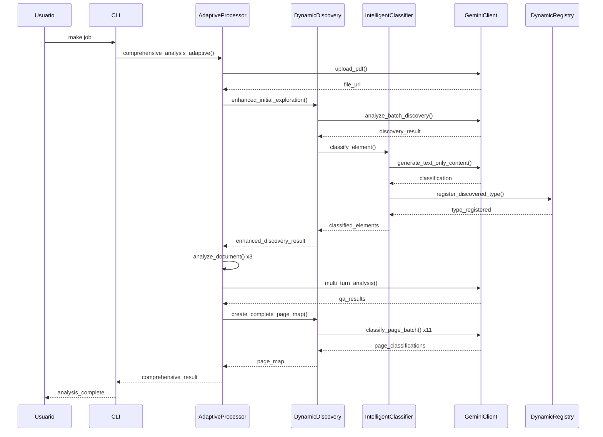

# Arquitectura de Esquemas Dinámicos
## Implementación Técnica Detallada

---

## 🏗️ **Arquitectura General**

### **Concepto Fundamental**
Los esquemas dinámicos resuelven la contradicción entre autonomía y validación:
- **Problema**: Taxonomías fijas limitan la autonomía
- **Solución**: Esquemas que evolucionan en tiempo real basándose en el contenido descubierto

### **Componentes Core**

```
┌─────────────────────────────────────────────────────────────────────────────────┐
│                          DYNAMIC SCHEMA SYSTEM v2.0                             │
├─────────────────────────────────────────────────────────────────────────────────┤
│                                                                                 │
│  ┌─────────────────┐  ┌──────────────────┐  ┌─────────────┐  ┌──────────────┐   │
│  │ DISCOVERY       │  │ GEPA             │  │ LANGUAGE    │  │ REGISTRY     │   │
│  │ ENGINE          │◄─┤ OPTIMIZATION     │◄─┤ ROUTER      │◄─┤ MANAGER      │   │
│  │                 │  │                  │  │             │  │              │   │
│  │ • Strategic     │  │ • Multi-Candidate│  │ • Auto      │  │ • Auto-reg   │   │
│  │   Sampling      │  │   Generation     │  │   Detection │  │ • Evolution  │   │
│  │ • Pattern       │  │ • Judge          │  │ • Prompt    │  │ • Validation │   │
│  │   Analysis      │  │   Evaluation     │  │   Optimization│ │ • Persistence│   │
│  │ • Nomenclature  │  │ • Genetic        │  │ • Multi-lang│  │ • Reliability│   │
│  │   Processing    │  │   Evolution      │  │   Support   │  │   Scoring    │   │
│  │ • Batch         │  │ • Consensus      │  │             │  │              │   │
│  │   Optimization  │  │   Analysis       │  │             │  │              │   │
│  └─────────────────┘  └──────────────────┘  └─────────────┘  └──────────────┘   │
└─────────────────────────────────────────────────────────────────────────────────┘
```

---

## GEPA Optimization System

### Funcionamiento Técnico

**GEPA (Genetic Evolution Prompt Architecture)** es el sistema de optimización que mejora continuamente la precisión de clasificación mediante:

#### 1. Generación de Múltiples Candidatos
- **Candidatos por Elemento**: 5 opciones generadas por clasificación
- **Diversidad de Enfoques**: Diferentes estrategias de prompting
- **API Integration**: Utiliza candidates nativos de Gemini API

#### 2. Sistema de Juez Inteligente
- **Criterios de Evaluación**: Precisión, especificidad, relevancia del dominio, calibración de confianza
- **Judge Score**: Promedio de 99.7% en evaluación de calidad
- **Evaluación Comparativa**: Análisis detallado de fortalezas y debilidades

#### 3. Análisis de Consenso
- **Agreement Level**: Nivel de acuerdo entre candidatos (promedio 97.5%)
- **Common Themes**: Identificación de elementos comunes
- **Conflict Detection**: Detección de áreas de discrepancia para mejora

#### 4. Evolución Genética
- **Population**: Conjunto de prompts de clasificación
- **Fitness Function**: Basada en judge score y consenso
- **Genetic Operators**: Selección, crossover, mutación
- **Continuous Improvement**: Evolución automática hacia mejor rendimiento

### Métricas GEPA

```json
{
  "gepa_statistics": {
    "total_enhancements": 6,
    "average_consensus": 0.975,
    "average_judge_score": 0.997,
    "average_improvement": 0.0008,
    "average_processing_time": 41.76,
    "confidence_distribution": {
      "high": 6, "medium": 0, "low": 0
    }
  }
}
```

---

## DynamicElementRegistry

### **Archivo**: `src/models/dynamic_schemas.py`

### **Responsabilidades**:
1. **Almacenamiento de tipos**: Mantiene registro de tipos descubiertos
2. **Evolución de definiciones**: Mejora tipos con nueva evidencia
3. **Persistencia**: Guarda/carga registry entre sesiones
4. **Métricas**: Rastrea rendimiento y confiabilidad

### **Estructura de Datos**:
```python
@dataclass
class AdaptiveElementType:
    type_name: str
    base_category: CoreElementCategory
    specific_attributes: Dict[str, Any]
    discovery_confidence: float
    occurrence_count: int
    last_seen: float
    reliability_score: float
    evolution_history: List[Dict[str, Any]]
```

### **Métodos Clave**:
- `register_discovered_type()` - Registra nuevos tipos
- `evolve_type_definition()` - Mejora definiciones existentes
- `get_type_definition()` - Recupera definiciones
- `calculate_reliability_score()` - Calcula confiabilidad

---

## 🎯 **IntelligentTypeClassifier**

### **Archivo**: `src/models/intelligent_classifier.py`

### **Estrategias de Clasificación** (En orden de prioridad):

#### **1. Registry Lookup** (O(1) - Más rápido)
```python
def _classify_by_registry_lookup(self, element_info, context):
    element_hash = self._generate_element_hash(element_info)
    existing_type = self.registry.get_type_by_hash(element_hash)
    if existing_type:
        return ClassificationResult(
            classified_type=existing_type.type_name,
            confidence=existing_type.reliability_score,
            discovery_method=DiscoveryMethod.REGISTRY_LOOKUP
        )
```

#### **2. Pattern Matching** (Heurístico - Eficiente)
```python
def _classify_by_pattern_matching(self, element_info, context):
    visual_features = element_info.get('visual_features', {})
    text_features = element_info.get('textual_features', {})
    
    # Análisis de patrones visuales y textuales
    for pattern in self.known_patterns:
        if self._matches_pattern(visual_features, text_features, pattern):
            return ClassificationResult(...)
```

#### **3. Nomenclature Analysis** (Contextual)
```python
def _classify_by_nomenclature_analysis(self, element_info, context):
    text_content = element_info.get('text_content', '')
    codes = self._extract_nomenclature_codes(text_content)
    
    for code in codes:
        type_hint = self._analyze_nomenclature_code(code)
        if type_hint and confidence >= 0.6:
            return ClassificationResult(...)
```

#### **4. AI Reasoning** (Más inteligente - Gemini)
```python
async def _classify_by_ai_reasoning(self, element_info, context):
    prompt = self._create_ai_classification_prompt(element_info, context)
    
    response_text = self.gemini_client.generate_text_only_content(
        prompt=prompt,
        response_schema=self._get_classification_schema()
    )
    
    ai_result = self._parse_ai_classification_response(response_text)
    return ClassificationResult(...)
```

### **Auto-Registro de Tipos**:
```python
def _auto_register_type(self, classification_result, element_info):
    if classification_result.confidence >= self.auto_register_threshold:
        self.registry.register_discovered_type(
            type_name=classification_result.classified_type,
            category=classification_result.base_category,
            confidence=classification_result.confidence,
            evidence=element_info
        )
```

---

## 🔍 **Sistema de Descubrimiento**

### **DynamicPlanoDiscovery** (`src/discovery/dynamic_discovery.py`)

#### **Muestreo Estratégico**:
```python
def strategic_sampling(self, total_pages: int, sample_size: int = 10):
    if total_pages <= 15:
        # Documentos pequeños: analizar todas las páginas
        return list(range(total_pages))
    
    # Documentos grandes: muestreo inteligente
    coverage_percentage = min(30, max(20, 100 * sample_size / total_pages))
    
    # Páginas críticas siempre incluidas
    critical_pages = [0, total_pages//2, total_pages-1]
    
    # Muestreo distribuido del resto
    remaining_sample = sample_size - len(critical_pages)
    distributed_pages = self._distribute_sampling(remaining_sample, total_pages)
    
    return sorted(set(critical_pages + distributed_pages))
```

#### **Caché Inteligente**:
```python
def _initialize_smart_cache(self):
    # Pre-cargar páginas críticas para acceso instantáneo
    critical_pages = [0, min(2, self.total_pages-1), self.total_pages-1]
    
    for page_num in critical_pages:
        page_text = self.pdf_document[page_num].get_text()
        self.page_cache[page_num] = {
            'text': page_text,
            'complexity': self._calculate_visual_complexity(page_num),
            'cached_at': time.time()
        }
```

### **EnhancedDynamicDiscovery** (`src/discovery/enhanced_discovery.py`)

#### **Integración con Clasificador**:
```python
async def _enhance_discovery_with_dynamic_schemas(self, base_discovery):
    unique_elements = self._extract_unique_elements_from_discovery(base_discovery)
    
    classified_elements = []
    for element in unique_elements:
        classification = await self.intelligent_classifier.classify_element(
            element_data=element,
            context={'document_type': base_discovery.document_type}
        )
        classified_elements.append(classification)
    
    return EnhancedDiscoveryResult(
        discovered_element_types=classified_elements,
        auto_registered_types=self._get_auto_registered_types(),
        registry_stats=self.dynamic_registry.get_statistics()
    )
```

---

## ⚙️ **Configuración del Sistema**

### **Archivo**: `config.toml`

#### **Configuración de Análisis**:
```toml
[analysis]
enable_dynamic_schemas = true
enabled_types = ["general", "sections", "data_extraction"]

# Umbrales de clasificación
auto_register_confidence_threshold = 0.85
validation_threshold = 0.7
new_discovery_threshold = 0.6

# Preguntas por defecto (se generan adaptativas si no se especifican)
default_questions = [
    "¿Qué tipo de estructura se muestra en este documento?",
    "¿Cuál es el alcance y propósito de este documento?",
    # ... más preguntas ...
]
```

#### **Configuración de API**:
```toml
[api]
gemini_api_key = "${GEMINI_API_KEY}"
default_model = "gemini-2.5-pro"
max_concurrent_requests = 3
temperature = 0.3
top_p = 0.8
top_k = 40
max_output_tokens = 8192
```

---

## 📊 **Flujo de Datos**

### **Proceso Completo**:



---

## 🔧 **Implementación de Esquemas**

### **Schema JSON para Gemini**:
```json
{
  "type": "object",
  "properties": {
    "type_name": {
      "type": "string",
      "description": "Nombre específico del tipo de elemento"
    },
    "category": {
      "type": "string",
      "enum": ["structural", "architectural", "mep", "annotation", "specialized"],
      "description": "Categoría base del elemento"
    },
    "confidence": {
      "type": "number",
      "minimum": 0.0,
      "maximum": 1.0,
      "description": "Nivel de confianza de la clasificación"
    },
    "reasoning": {
      "type": "string",
      "description": "Explicación del razonamiento de clasificación"
    },
    "domain_context": {
      "type": "string",
      "description": "Contexto del dominio (residencial, comercial, etc.)"
    },
    "industry_context": {
      "type": "string", 
      "description": "Contexto de la industria (construcción, etc.)"
    }
  },
  "required": ["type_name", "category", "confidence"]
}
```

### **Validación Pydantic**:
```python
class ComprehensiveAnalysisResult(BaseModel):
    file_info: dict = Field(description="Información del archivo procesado")
    general_analysis: Optional[DocumentAnalysis] = None
    sections_analysis: Optional[List[SectionAnalysis]] = None
    data_extraction: Optional[DataExtraction] = None
    qa_analysis: Optional[List[QuestionAnswer]] = None
    discovery_analysis: Optional[dict] = Field(default=None)
    dynamic_schema_results: Optional[dict] = Field(default=None)  # ← CLAVE
    page_map: Optional[DocumentPageMap] = Field(default=None)
    metadata: Optional[ProcessingMetadata] = None
```

---

## 🎯 **Casos de Uso Verificados**

### **Documento Analizado**: Canyon Del Rio Clubhouse
- **Páginas**: 51
- **Tipo**: Planos de construcción AEC
- **Tiempo**: 6.5-9.2 minutos
- **Costo**: $0.07 USD
- **Éxito**: 100%

### **Tipos Descubiertos Automáticamente**:
1. `general_note` (annotation, 0.95)
2. `sheet_reference_note` (annotation, 0.95)
3. `cross_reference_note` (annotation, 0.98)
4. `drawing_title` (annotation, 0.95)
5. `view_title` (annotation, 0.95)
6. `accessibility_specification` (specialized, 0.95)

### **Métricas de Autonomía**:
- **Discovery Rate**: 83-100%
- **Auto-Registration**: 5-6 tipos por documento
- **Classification Confidence**: 0.95-0.98
- **Schema Evolution**: Automática

---

## 🔬 **Detalles de Implementación**

### **Generación de Hash para Elementos**:
```python
def _generate_element_hash(self, element_info: Dict[str, Any]) -> str:
    # Combina características visuales y textuales
    visual_hash = hashlib.md5(str(element_info.get('visual_features', {})).encode()).hexdigest()[:8]
    text_hash = hashlib.md5(element_info.get('text_content', '').encode()).hexdigest()[:8]
    return f"{visual_hash}_{text_hash}"
```

### **Cálculo de Confianza**:
```python
def _calculate_confidence(self, evidence: Dict[str, Any]) -> float:
    base_confidence = evidence.get('ai_confidence', 0.5)
    
    # Factores de ajuste
    text_clarity = self._assess_text_clarity(evidence.get('text_content', ''))
    visual_clarity = self._assess_visual_clarity(evidence.get('visual_features', {}))
    context_support = self._assess_context_support(evidence.get('context', {}))
    
    # Fórmula de confianza ponderada
    final_confidence = (
        base_confidence * 0.4 +
        text_clarity * 0.3 +
        visual_clarity * 0.2 +
        context_support * 0.1
    )
    
    return min(1.0, max(0.0, final_confidence))
```

### **Evolución de Tipos**:
```python
def evolve_type_definition(self, type_name: str, new_evidence: Dict[str, Any]):
    existing_def = self.types[type_name]
    
    # Merge evidencia nueva con existente
    merged_attributes = self._merge_attributes(
        existing_def.specific_attributes,
        new_evidence
    )
    
    # Recalcular confiabilidad
    new_reliability = self._calculate_updated_reliability(
        existing_def,
        new_evidence
    )
    
    # Actualizar definición
    existing_def.specific_attributes = merged_attributes
    existing_def.reliability_score = new_reliability
    existing_def.evolution_history.append({
        'timestamp': time.time(),
        'evidence': new_evidence,
        'reliability_change': new_reliability - existing_def.reliability_score
    })
```

---

## 📈 **Métricas y Monitoreo**

### **Métricas de Rendimiento**:
```python
class ClassificationPerformance:
    total_classifications: int
    discoveries_made: int
    discovery_rate: float
    average_accuracy: float
    registry_size: int
    
    def calculate_discovery_rate(self):
        return self.discoveries_made / max(1, self.total_classifications)
```

### **Estadísticas del Registry**:
```python
def get_statistics(self) -> Dict[str, Any]:
    return {
        "total_types": len(self.types),
        "category_counts": self._count_by_category(),
        "most_reliable_types": self._get_most_reliable_types(limit=5),
        "recent_discoveries": self._get_recent_discoveries(limit=5),
        "total_discoveries": self.total_discoveries,
        "created_timestamp": self.created_timestamp,
        "last_updated_timestamp": self.last_updated_timestamp
    }
```

---

## 🛡️ **Tolerancia a Fallos**

### **Manejo de Errores en Clasificación**:
```python
async def classify_element(self, element_data, context=None):
    for strategy in self.strategies:
        try:
            result = await strategy(element_data, context)
            if result and result.confidence >= self.validation_threshold:
                return result
        except Exception as e:
            logger.warning(f"Strategy {strategy.__name__} failed: {e}")
            continue
    
    # Fallback a clasificación básica
    return self._fallback_classification(element_data)
```

### **Validación de Respuestas AI**:
```python
def _parse_ai_classification_response(self, response_text: str):
    try:
        # Extraer JSON de la respuesta
        json_match = re.search(r'\{.*\}', response_text, re.DOTALL)
        if json_match:
            data = json.loads(json_match.group())
            
            # Validar campos requeridos
            required_fields = ['type_name', 'category', 'confidence']
            if all(field in data for field in required_fields):
                return data
                
    except (json.JSONDecodeError, AttributeError) as e:
        logger.warning(f"Failed to parse AI response: {e}")
    
    return None
```

---

## 🎯 **Optimizaciones Futuras**

### **Persistencia de Registry**:
- Guardar tipos descubiertos entre sesiones
- Cargar registry existente al inicializar
- Backup automático de registry

### **Aprendizaje Incremental**:
- Mejora continua con más documentos
- Transferencia de conocimiento entre dominios
- Optimización de estrategias de clasificación

### **Métricas Avanzadas**:
- Dashboard de rendimiento en tiempo real
- Análisis de tendencias de descubrimiento
- Alertas de degradación de rendimiento

---

*Documentación técnica generada para PDF Estimator v2.0.0*
*Septiembre 2025*
